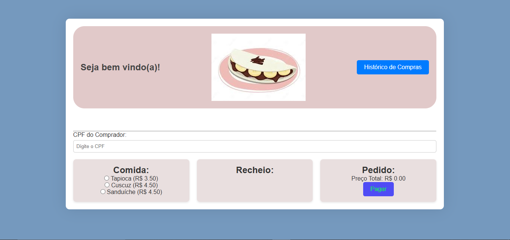

# Projeto das Tapiocas

Este projeto permite que o usuário explore e visualize informações do Projeto Tapioca.

## Imagens do projeto

## Endpoints do projeto

@GetMapping("/food")
@GetMapping("/history")
@PostMapping("/payment")

## Funcionalidades

- Exibição de uma lista de: 
- comida
- recheio 
- pedeido.

## Tecnologias Utilizadas

- **HTML**: Estrutura do conteúdo da página.
- **CSS**: Estilização visual, responsividade e layout das páginas.

